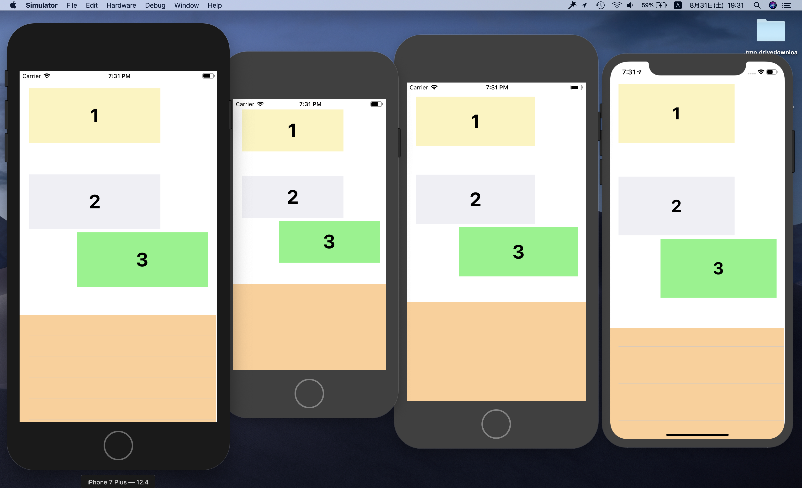

# EasyAutoLayout
EasyAutoLayout may help you who are not good at adjusting the layout for different devices.

# My Ambition
1. You will not have to use `NSLayoutConstraint` which have many init params...
2. You will just create one device layout and as for others, EasyAutoLayout will compute frame and return expected layout.
3. there are many others...

# Current Version Condition (current version == 0.0.1)



something like this. This app never do autoLayout in the project just call special method. `EasyAutoLayoutViewController().setAutoLayout(targetView: UIView)`

```ViewController.swift
import UIKit
import EasyAutoLayout

class ViewController: EasyAutoLayoutViewController {
    
    override func viewDidLoad() {
        super.viewDidLoad()
        view.subviews.forEach({setAutoLayout(targetView: $0)})        
    }
}
```
