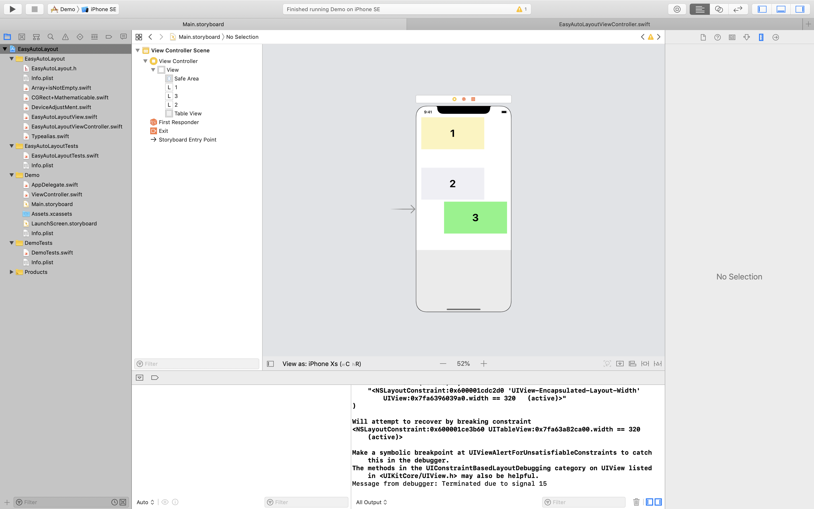

# EasyAutoLayout
`EasyAutoLayout`はAutoLayoutが不得意・あるいは学習していない開発者が簡易的にAutoLayoutを実装できることを目的としています。
Storyboard上でiPhoneXまたはiPhoneXSのレイアウトを組めば、他のレイアウトは自動で対応してくれることを目標としています。

# My Ambition
- とても沢山の引数を持つ`NSLayoutConstraint`... これは熟練の開発者なら毛でもないですが、ビギナーにとっては決して簡単なものではないはずです。この`EasyAutoLayout`はそういったデベロッパーの手助けになることを目標に開発を始めました。
- 将来的には、熟練のデベロッパーにも使ってもらいたいです。

# 現在の状況 (current version == 1.0.0)

## Storyboard上でのレイアウト


## 実際のレイアウト


# How to user
いつも通り継承している`UIViewController`の代わりに`EasyAutoLayoutViewController`を継承するのみです。

```Example.swift
import UIKit
import EasyAutoLayout

class ViewController: EasyAutoLayoutViewController {
}
```


# Done
- [✅] iPhoneXでレイアウトを組めば、自動で他のデバイスサイズにも対応してくれる。(バグがあれば報告ください。)
- [✅] 他の`UIView`と重ならない。

# ToDo
- [] 

## License
MIT